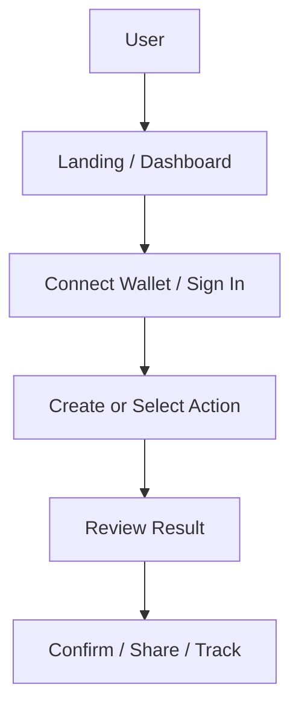
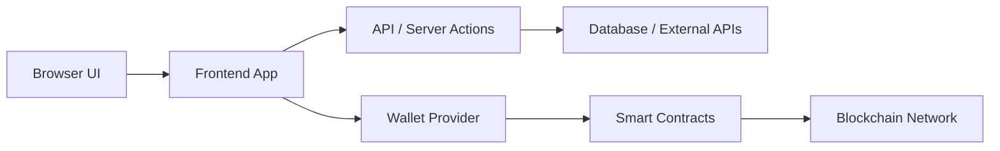

# Repo README Writer

## Core Rule

Inspect the current repository before writing. Do not produce a generic README from memory when local files can reveal the actual product, stack, commands, contracts, or architecture.

## Workflow

1. Inspect project files with fast targeted reads:
   - Existing `README.md`
   - `package.json`, lockfiles, workspace configs
   - `src/`, `app/`, `pages/`, `components/`, `backend/`, `server/`
   - `contracts/`, `script/`, `ignition/`, `deployments/`, `foundry.toml`, `hardhat.config.*`
   - `.env.example`, config files, Docker/deployment files
2. Decide the README mode:
   - **Update mode**: if the existing README has useful product, setup, architecture, or contract information, preserve and improve it.
   - **New mode**: if no README exists or the existing README is mostly empty, placeholder, stale, or irrelevant, create a full replacement.
3. Infer the product from code and docs:
   - What the app does
   - Who it is for
   - Why it exists
   - Main user journey
   - Frontend/backend/on-chain/data flow
   - Run commands and required environment
4. Decide diagram flow:
   - In **New mode**, create fresh User Flow and System Architecture Flow diagrams.
   - In **Update mode**, inspect the existing README for Mermaid diagrams, ASCII diagrams, image links, or external diagram links before creating anything new.
   - Prefer Mermaid diagrams directly in the README because GitHub renders them without generated image files or paid services.
   - Use ASCII only when Mermaid would be too complex or the target Markdown renderer does not support Mermaid.
5. Ask only when important facts cannot be inferred safely:
   - Target user or story scenario is unclear
   - Smart contract network/address is missing or ambiguous
   - Setup commands cannot be inferred
   - Product name conflicts across files
6. Write or update `README.md`.
7. Re-read the final README for broken structure, false claims, missing required sections, and commands that do not match the repo.

## Clarifying Q&A

Prefer inference from the repository, but ask the user concise questions when missing information would make the README misleading or weak. Do not ask about details already visible in files.

Ask at most 3-5 questions at once. Prioritize questions that affect the story, setup, deployment, or contract sections.

Good questions:
- What is the intended user or judge-facing story for this project?
- What problem should the README emphasize?
- Which network are the smart contracts deployed on?
- Are these contract addresses final or placeholders?
- Is there a live demo, video, or screenshot link to include?
- Are there required environment variables not shown in `.env.example`?

If the user does not answer, proceed with `TBD` for unknown values and state what was inferred from the repo.

## Required README Sections

Use these sections unless the user asks for a different order. Keep headings clear and readable.

```md
# Project Name

## Story Scenario

## Problem Statement

## Solution

## Product Concept

## User Flow

## System Architecture Flow

## Tech Stack

## Smart Contracts

## Getting Started

## Environment Variables

## Running Locally

## Project Structure

## Demo / Screenshots

## Roadmap

## Notes
```

If a section truly does not apply, keep it brief rather than inventing content. For example, a non-Web3 repo can say under Smart Contracts: "This project does not use smart contracts."

## Section Guidance

### Story Scenario

Write a short scenario that makes the project feel real. Use a concrete user, context, and pain point. Avoid vague marketing copy.

### Problem Statement

State the problem in practical terms. Explain what is broken, inefficient, risky, confusing, or missing.

### Solution

Explain how the project solves the problem. Tie the solution to actual implemented features, not imagined future features.

### Product Concept

Describe the product as a buildable system:
- Core experience
- Key features
- Primary user
- What makes the approach distinct

### User Flow

Always include a user flow diagram. Prefer Mermaid directly in the README. Use ASCII only as a fallback.

Mermaid example:



ASCII fallback example:

```text
User
  |
  v
Landing / Dashboard
  |
  v
Connect Wallet / Sign In
  |
  v
Create or Select Action
  |
  v
Review Result
  |
  v
Confirm / Share / Track
```

### System Architecture Flow

Always include a system architecture diagram based on the actual repo. Prefer Mermaid directly in the README. Use ASCII only as a fallback.

Mermaid example:



ASCII fallback example:

```text
Browser UI
  |
  v
Frontend App
  |
  +--> API / Server Actions
  |       |
  |       v
  |     Database / External APIs
  |
  +--> Wallet Provider
          |
          v
       Smart Contracts
          |
          v
       Blockchain Network
```

### Diagram Update Rules

For a new README:
- Create Mermaid diagrams for User Flow and System Architecture Flow.
- Keep node labels short and readable.
- Use left-to-right or top-down direction consistently.

For an existing README:
- First check whether the README already has Mermaid diagrams, ASCII diagrams, image links, or external diagram links.
- If existing Mermaid diagrams are present, update those diagrams instead of adding duplicates.
- If existing ASCII diagrams are present, replace them with Mermaid when the flow is clear.
- If existing image or external diagram links are present, preserve them when still accurate.
- Do not delete old diagrams unless they are clearly obsolete or replaced by better current Mermaid diagrams.
- Do not create duplicate diagrams on repeated README updates.

### Tech Stack

Use a grouped list or table. Include only technologies actually present or clearly required.

Suggested groups:
- Frontend
- Backend
- Database / Storage
- Blockchain / Web3
- AI / APIs
- Tooling
- Deployment

### Smart Contracts

For Web3 projects, include a table:

```md
| Contract | Network | Address | Purpose |
| --- | --- | --- | --- |
| ExampleContract | Monad Testnet | `0x...` | Handles ... |
```

Find addresses in deployment files, config files, `.env.example`, frontend constants, docs, or scripts. Do not hallucinate addresses.

If addresses are missing:

```md
| Contract | Network | Address | Purpose |
| --- | --- | --- | --- |
| ExampleContract | TBD | TBD | Handles ... |
```

### Getting Started / Running Locally

Use commands from the repo. Prefer exact package scripts over generic commands.

If scripts are available, show the shortest reliable setup:

```bash
npm install
npm run dev
```

Do not claim a command works unless it is present or strongly implied by the repo.

### Environment Variables

Read `.env.example` if present. Use a table:

```md
| Variable | Purpose |
| --- | --- |
| NEXT_PUBLIC_CONTRACT_ADDRESS | Frontend contract address |
```

If no env example exists, include a short note and only list variables discovered in code.

### Demo / Screenshots

If assets exist, reference them. If not, use a placeholder sentence:

```md
Add screenshots or a demo link here after deployment.
```

## Style

- Write like a polished hackathon/product README.
- Be concrete and repo-specific.
- Prefer short paragraphs and tables.
- Use emojis sparingly when they improve scanning or make the README feel less dry, such as in section headings, feature bullets, status notes, or demo callouts.
- Do not force emojis into every heading or bullet. Avoid repeated emoji patterns, decorative clutter, or emojis in technical commands, code blocks, addresses, environment variable names, tables where they reduce clarity, or legal/security notes.
- Prefer one useful emoji per relevant heading or bullet group when it helps the reader quickly recognize the section's purpose.
- Avoid hype that the code does not support.
- Avoid long architecture essays.
- Preserve useful existing README content in update mode.
- Remove stale boilerplate when replacing a weak README.

## Safety

- Do not invent smart contract addresses, deployed URLs, API keys, metrics, sponsors, prizes, or production status.
- Mark unknown values as `TBD`.
- If the repo is private or incomplete, say what was inferred from available files.
- If the README is for judging/demo use, prioritize clarity of product story and local run instructions.
