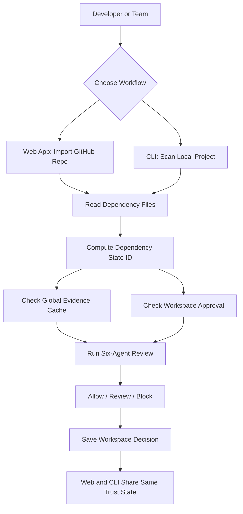
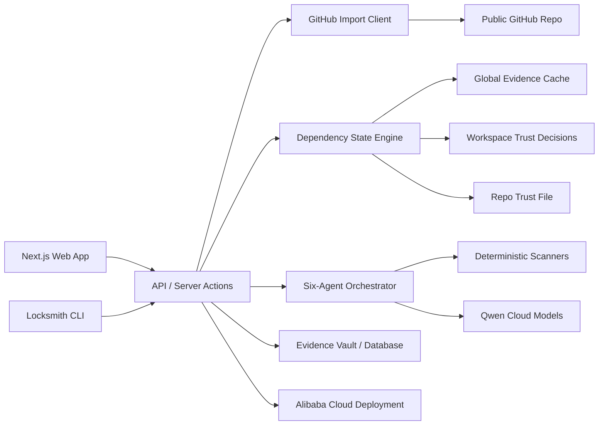
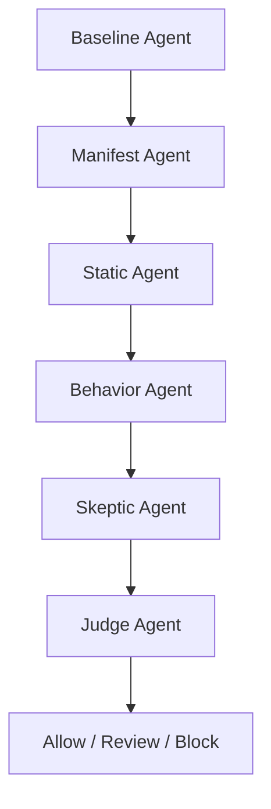

# Locksmith

Locksmith is a Qwen-powered dependency safety tool for developers and small teams. It reviews dependency changes before they enter a project, using a six-agent security panel that checks what changed, inspects package metadata, scans suspicious code, tests behavior, challenges false positives, and produces an `Allow`, `Review`, or `Block` verdict.

> Locksmith puts dependency changes on trial before they enter your lockfile.

Primary hackathon track: **Track 3: Agent Society**  
Secondary fit: **Track 4: Autopilot Agent**

## Story Scenario

A small team is preparing a release. One developer runs `npm install`, another updates `requirements.txt`, and a third reviews a GitHub PR that changed the lockfile. Everyone sees a familiar problem: the package manager is about to pull code written by strangers, possibly including new install scripts, transitive packages, or behavior that was never reviewed by the team.

Locksmith acts like a shared security review desk. It does not ask only whether a package is suspicious in public. It asks whether this exact dependency state is safe for this repo, branch, lockfile, workspace policy, and install context.

## Problem Statement

Developers trust dependency updates too casually.

Modern projects install hundreds of npm and Python packages, and risky behavior can enter through direct dependencies, transitive dependencies, install scripts, or newly published versions. Existing package scanners often produce public package-level risk, but teams still lack a shared answer to:

- Was this exact dependency state reviewed?
- Which repo, branch, commit, and lockfile was approved?
- Did the verdict apply to this team policy or only to a public package report?
- Should the terminal install and the web dashboard trust the same review?
- What changed since the last approved state?

Without a shared trust record, each developer can end up making isolated local decisions about the same dependency state.

## Solution

Locksmith creates a shared dependency safety layer across web and terminal workflows.

It computes a stable **Dependency State ID** from repo, branch, commit, package manager, dependency file hashes, and lockfile hashes. Reviews are tied to dependency states, while approvals are tied to a workspace or team.

The result:

- public/package evidence can be reused,
- team approval stays private and policy-specific,
- terminal and web app decisions stay consistent,
- old approvals can be invalidated when the lockfile, policy, or threat intelligence changes.

## Product Concept

Locksmith has two main entry points.

| Surface | Purpose |
| --- | --- |
| Web app | Import a public GitHub repo, inspect dependency files, run a six-agent review, and save workspace trust decisions. |
| Terminal CLI | Review local dependency files before install/update and check whether the current state matches a workspace-approved baseline. |

MVP package ecosystems:

| Ecosystem | Files | Install Story |
| --- | --- | --- |
| npm | `package.json`, `package-lock.json` | `npm install` / dependency update review |
| Python/pip | `requirements.txt` | `pip install -r requirements.txt` review |

The core distinction:

- NPMGuard-style tools answer: **"Is this package suspicious?"**
- Locksmith answers: **"Is this dependency state safe for this repo/workspace under this policy?"**

## User Flow



## System Architecture Flow



## Six-Agent Review Panel

Locksmith uses six MVP agents. Each agent has a narrow job and produces structured evidence.

| Agent | Role | Example Output |
| --- | --- | --- |
| Baseline Agent | Compares current dependency state against the last approved baseline. | `colors 2.0.0 -> 3.0.0` |
| Manifest Agent | Checks metadata, lifecycle scripts, release age, maintainer signals, and package purpose mismatch. | `new postinstall script added` |
| Static Agent | Scans source for suspicious patterns before execution. | `process.env`, `child_process`, encoded URL |
| Behavior Agent | Tests or simulates install/runtime behavior in isolation. | `outbound request observed during install` |
| Skeptic Agent | Challenges false positives and asks whether behavior is legitimate. | `env access may be normal for CLI packages` |
| Judge Agent | Resolves disagreement into final verdict. | `Block: evidence survived skeptic critique` |

Track 3 proof:



## Trust Model

Core rule:

> Reviews belong to dependency states. Approvals belong to workspaces.

### Dependency State ID

Every scan computes a fingerprint from:

- repo URL, when available
- branch and commit SHA, when available
- package manager
- dependency file hashes
- lockfile hashes

If the web app and CLI scan the same repo commit and dependency files, they should resolve to the same dependency state ID.

### Global Evidence vs Workspace Approval

| Layer | Shared? | Purpose |
| --- | --- | --- |
| Global Evidence Cache | Yes, when non-sensitive | Reusable package facts, metadata, suspicious behavior, known bad versions. |
| Workspace Trust Decisions | No | Team-specific allow/review/block approvals under a policy. |
| Local Cache | Local only | Speed. Not the source of truth. |
| Repo Trust File | Shared in Git | Lightweight pointer to approved state and review ID. |

Example repo trust pointer:

```json
{
  "workspace": "acme",
  "reviewId": "rev_123",
  "dependencyStateId": "state_456",
  "approvedCommit": "abc123",
  "lockfileHash": "sha256:xyz",
  "policy": "strict",
  "verdict": "allow",
  "approvedAt": "2026-06-17T10:00:00Z"
}
```

## MVP vs Production Data Strategy

For the hackathon MVP, Locksmith stores dependency states, reviews, agent findings, workspace approvals, and review history in the hosted backend database. This keeps the demo simple, testable, and easy to explain.

For production, Locksmith should not store every user's full project state forever. The scalable design is:

| Layer | Production Strategy |
| --- | --- |
| Global package evidence | Store once by package/version/hash and reuse across workspaces. |
| Dependency state | Represent as a content hash from dependency files and lockfiles, not a permanent full repo snapshot. |
| Workspace approval | Store a tiny pointer: workspace, state hash, policy, decision, review ID, timestamp. |
| Repo trust file | Keep the approved state pointer in Git so CLI and CI can verify the local state. |
| Full agent traces | Keep under retention policies or export to customer-owned storage. |
| Enterprise storage | Support bring-your-own Alibaba OSS/S3-compatible bucket or self-hosted evidence vault. |

Production answer for scale:

> Locksmith uses a content-addressed model. Heavy evidence is deduplicated globally by package/version/hash, while teams store only small approval pointers to dependency state hashes. The CLI can recompute the same state hash locally, so raw project files do not need to live in Locksmith forever.

## Demo Flow 1: Web App GitHub Import

The web app demo should show a public GitHub repo import.

1. Paste a public GitHub repo URL.
2. Locksmith fetches the repo tree and detects dependency files.
3. Locksmith computes the dependency state ID.
4. The dashboard shows `Global Analysis` and `Your Workspace` as separate states.
5. Six agents review changed or risky dependencies.
6. The Skeptic Agent challenges at least one finding.
7. The Behavior Agent provides stronger evidence.
8. The Judge Agent returns `Block`.
9. The user saves the workspace decision.
10. The evidence appears in review history.

Demo screens to show:

- repo import form
- dependency state overview
- dependency diff table
- six-agent timeline
- verdict panel
- evidence vault / review history

## Demo Flow 2: Terminal CLI Review

The terminal demo should show install-time safety and consistency with the web app.

```bash
locksmith scan .
```

Expected output shape:

```text
Dependency state: state_456
Global evidence: reviewed
Workspace status: review required
Verdict: BLOCK
Reason: package update added postinstall + env access + outbound request
Recommendation: pin previous approved version
```

If the same dependency state was already approved in the web app:

```text
Dependency state: state_456
Workspace status: approved
Install allowed
```

This proves that the terminal and web app are clients of the same dependency-state and workspace-approval model.

## Tech Stack

| Layer | Technology |
| --- | --- |
| Frontend | Next.js, React, TypeScript |
| UI Structure | Components, feature modules, shared UI primitives |
| Backend | Next.js API routes or server actions |
| AI | Qwen models through Qwen Cloud |
| Dependency Sources | GitHub REST API, raw GitHub files, npm registry, PyPI metadata |
| Scanning | Lockfile parsing, manifest checks, static pattern checks, controlled behavior checks |
| Database / Storage | SQLite or Postgres locally; Alibaba Cloud-hosted database for deployment proof |
| Deployment | Alibaba Cloud ECS, Function Compute, or Container Service |
| CLI | Node.js CLI package or local demo script |

## Smart Contracts

This project does not use smart contracts in the MVP.

Earlier project ideas used Web3 payment and audit records, but Locksmith is intentionally Web2-first for this hackathon:

- no wallet connect,
- no token payment,
- no staking,
- no on-chain slashing,
- no public on-chain report requirement.

## Getting Started

The repository is currently in planning/scaffold stage. The intended app will be a Next.js + React project with a CLI companion.

Planned setup after scaffold:

```bash
npm install
npm run dev
```

Planned CLI usage:

```bash
locksmith scan .
locksmith review package-lock.json
locksmith review requirements.txt
locksmith status
```

## Environment Variables

No `.env.example` exists yet. Planned variables:

| Variable | Purpose |
| --- | --- |
| `QWEN_API_KEY` | API key for Qwen Cloud model calls. |
| `QWEN_MODEL` | Qwen model identifier used by the agent society. |
| `DATABASE_URL` | Database connection string for review history and evidence vault. |
| `GITHUB_TOKEN` | Optional token for higher GitHub API rate limits or private repo support later. |
| `LOCKSMITH_WORKSPACE_ID` | Default workspace for local CLI/demo flows. |

## Running Locally

Current repo state:

- `PLAN.md` contains the implementation plan.
- `AGENTS.md` contains project-specific working instructions.
- App scaffold and package scripts are not created yet.

Once scaffolded, the expected local flow is:

```bash
npm install
npm run dev
```

## Project Structure

Planned monorepo shape:

```text
.
├── apps/
│   ├── web/              # Next.js app
│   └── cli/              # Node CLI package
├── packages/
│   ├── agents/           # Six-agent orchestration
│   ├── core/             # Dependency state, policy, verdict types
│   ├── github/           # GitHub import client
│   ├── scanners/         # Lockfile, manifest, static, behavior tools
│   └── ui/               # Shared React UI components
├── docs/
│   └── demo-script.md
├── AGENTS.md
├── PLAN.md
└── README.md
```

If build time is tight, the first implementation can use a single Next.js app with local folders:

```text
.
├── app/
├── components/
├── features/
│   ├── repo-import/
│   ├── dependency-review/
│   ├── agent-timeline/
│   ├── evidence-vault/
│   └── cli-preview/
├── lib/
│   ├── agents/
│   ├── github/
│   ├── qwen/
│   ├── scanners/
│   └── state/
└── cli/
```

## Demo / Screenshots

Screenshots and demo video are TBD after the Next.js app is scaffolded.

Required demo moments:

1. Import a public GitHub repo.
2. Show dependency state ID and workspace approval status.
3. Show npm and Python dependency file detection.
4. Show a changed dependency.
5. Show six agents producing findings.
6. Show Skeptic Agent challenging a false positive.
7. Show Judge Agent returning `Block`.
8. Show terminal CLI reading the same state.
9. Show review history proving version-controlled safety decisions.
10. Show backend deployment proof on Alibaba Cloud.

## Roadmap

### MVP

- Next.js web app
- Public GitHub repo import
- npm `package.json` / `package-lock.json` review
- Python `requirements.txt` review
- Dependency State ID
- Six-agent review timeline
- Qwen-backed reasoning
- Evidence vault and review history
- CLI command: `locksmith scan .`
- Alibaba Cloud backend deployment proof

### After MVP

- Private GitHub repo OAuth
- Real install wrappers: `locksmith npm install`, `locksmith pip install -r requirements.txt`
- Stronger sandboxing
- CI/PR check integration
- Policy editor
- Custom enterprise model endpoint
- More package managers such as pnpm, Yarn, Poetry, and uv

## Notes

- Locksmith is a Web2-first dependency safety workflow, not a Web3 audit marketplace.
- Public scans do not equal owner or workspace approval.
- Local terminal cache is for speed only and should not be treated as a team trust source.
- The first implementation should prioritize the state model and agent collaboration over broad package-manager coverage.
