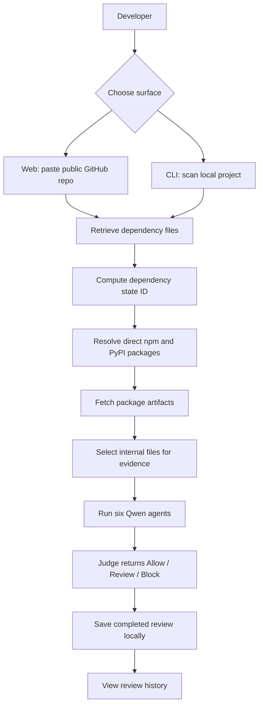
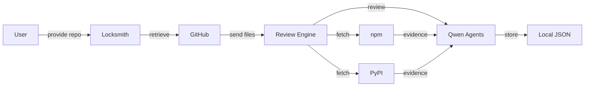

# Locksmith

Locksmith is a Qwen-powered dependency safety reviewer for developers and small teams. It puts a repository dependency state through six specialist agents before a package change is trusted.

> Locksmith puts dependency changes on trial before they enter your lockfile.

Primary hackathon track: **Track 3: Agent Society**

## Story Scenario

A small team is preparing a release. A dependency update lands right before merge, and nobody wants to approve a lockfile or requirements file by gut feel. Locksmith lets the team paste a public GitHub repo or scan a local project, retrieves the dependency files, inspects real npm/PyPI package artifacts, and asks six Qwen agents to decide whether the state should be allowed, reviewed, or blocked.

## Problem Statement

Package managers make it easy to install code the team has not reviewed. A package update can add lifecycle scripts, build hooks, transitive dependencies, network behavior, local file access, or source patterns that are risky for one repo but normal in another.

Most scanners answer, "Is this package suspicious?" Locksmith is aimed at the more useful team question:

> Is this exact dependency state safe for this repo, under this review policy, with the evidence we retrieved?

## Solution

Locksmith retrieves dependency files, computes a stable dependency state ID, fetches real package code from npm and PyPI, runs six role-specific Qwen agents, and saves completed reviews locally.

Implemented today:

- Public GitHub repo lookup and branch selection.
- Dependency file detection for `package.json`, `package-lock.json`, `pnpm-lock.yaml`, `yarn.lock`, `requirements.txt`, and `pyproject.toml`.
- npm direct dependency inspection from `package.json` plus exact versions from `package-lock.json`.
- PyPI dependency inspection from pinned `requirements.txt` and simple `pyproject.toml` dependency strings.
- npm tarball retrieval and selected internal file inspection.
- PyPI sdist/wheel artifact retrieval and selected internal file inspection.
- Static package evidence selection for metadata, manifests, entrypoints, lifecycle/build files, and suspicious source patterns.
- Six real Qwen agent calls with structured verdicts, evidence, confidence, and remediation.
- Review jobs with live package and agent progress.
- Local review history stored in `.locksmith/reviews.json`.
- Node CLI for scanning local dependency files with the same core engine.

## Product Concept

Locksmith is a Web2-first supply-chain review tool. It is not a wallet, token, staking, or on-chain audit product.

Core surfaces:

| Surface | Current state |
| --- | --- |
| Landing page | Explains the six-agent dependency review flow and links into scanning. |
| `/review` page | Imports a public GitHub repo, chooses a branch, starts a Qwen review, shows package retrieval, agent progress, and final report. |
| `/history` page | Reads local saved reviews and shows prior non-allow findings. |
| CLI | Local demo command only: `node bin/locksmith.mjs scan [project-directory]` reviews local dependency files with the same core engine. Locksmith is not published on npm yet. |

## User Flow



## System Architecture Flow



## Six-Agent Review Panel

| Agent | Implemented role |
| --- | --- |
| Baseline | Identifies package manager, direct dependencies, exact/pinned versions, package inspection coverage, and missing evidence. |
| Manifest | Reviews npm `package.json`, PyPI metadata/build files, repo manifests, lifecycle scripts, build hooks, entrypoints, and purpose mismatch. |
| Static | Reviews selected package files for risky patterns such as `eval`, dynamic `Function`, env access, file access, URLs, `child_process`, `subprocess`, shell execution, and persistence indicators. |
| Behavior | Infers install/runtime behavior from retrieved files and labels it as inferred, not sandbox-observed. |
| Skeptic | Challenges unsupported claims and filters false positives before final judgment. |
| Judge | Resolves the prior findings into `Allow`, `Review`, or `Block` with the smallest remediation. |

## Tech Stack

| Layer | Technology |
| --- | --- |
| Frontend | Next.js 15, React 19, TypeScript, CSS |
| Backend | Next.js API routes on Node.js runtime |
| AI | Qwen through Alibaba Cloud Model Studio's OpenAI-compatible API |
| External data | GitHub REST/raw files, npm registry, npm tarballs, PyPI JSON API, PyPI sdists/wheels |
| Storage | Local JSON file at `.locksmith/reviews.json` |
| CLI | Node.js executable script in `bin/locksmith.mjs` |
| Tests | Node's built-in test runner |

## Smart Contracts

This project does not use smart contracts.

## Getting Started

Requirements:

- Node.js 20 or newer
- A Qwen API key from Alibaba Cloud Model Studio

```bash
npm install
cp .env.example .env.local
npm run dev
```

Open [http://localhost:3000](http://localhost:3000).

## Environment Variables

| Variable | Purpose |
| --- | --- |
| `QWEN_API_KEY` | Required. Alibaba Cloud Model Studio API key used for real agent analysis. |
| `QWEN_MODEL` | Required. Model name sent to the Qwen API. `.env.example` uses `qwen3.5-flash`. |
| `QWEN_BASE_URL` | Optional OpenAI-compatible endpoint. Defaults to `https://dashscope-intl.aliyuncs.com/compatible-mode/v1`. |

There is no mock mode in the current app. Reviews fail fast when `QWEN_API_KEY` or `QWEN_MODEL` is missing.

## Running Locally

Start the web app:

```bash
npm run dev
```

Build the app:

```bash
npm run build
```

Run the local tests:

```bash
npm test
```

Scan a local project with the CLI:

```bash
node bin/locksmith.mjs scan .
```

Current CLI install status:

- The CLI is a local demo script in this repository.
- It is not published to npm yet.
- It does not currently install a global `locksmith` command.
- The intended future flow is `locksmith npm install ...` or `locksmith pip install ...`, but those install-wrapper commands are not implemented yet.

Inspect a public GitHub repo through the API:

```bash
curl -sS -X POST http://localhost:3000/api/repo \
  -H 'Content-Type: application/json' \
  -d '{"repo":"https://github.com/owner/repo"}'
```

Start a review:

```bash
curl -sS -X POST http://localhost:3000/api/review \
  -H 'Content-Type: application/json' \
  -d '{"repo":"https://github.com/owner/repo","branch":"main"}'
```

The review endpoint returns a `reviewId`. Poll `/api/review/{reviewId}` for package retrieval progress, agent progress, and final results.

## Project Structure

```text
.
├── app/
│   ├── api/
│   │   ├── history/          # Reads local review history
│   │   ├── repo/             # Public GitHub repo inspection
│   │   └── review/           # Starts and polls review jobs
│   ├── components/           # Shared header and repo search form
│   ├── history/              # Saved review UI
│   ├── review/               # Live review UI and final report
│   └── page.tsx              # Landing page
├── bin/locksmith.mjs         # Local CLI scanner
├── lib/
│   ├── locksmith.ts          # Core review engine and Qwen agent prompts
│   ├── npmPackages.ts        # npm registry/tarball package evidence
│   ├── pythonPackages.ts     # PyPI artifact package evidence
│   ├── reviewHistory.ts      # Local JSON history
│   └── reviewJobs.ts         # In-memory async review jobs
├── test/
│   └── python-packages.test.ts
├── SUBMISSION.md             # Hackathon submission requirements
└── README.md
```

## Demo / Screenshots

Demo assets are still needed.

Recommended demo flow:

1. Open the landing page.
2. Paste a public GitHub repository into `/review`.
3. Show dependency file detection and branch selection.
4. Start the Qwen review.
5. Show real npm/PyPI package artifact retrieval.
6. Show the six-agent progress timeline.
7. Show the final verdict, evidence, remediation, model, and dependency state ID.
8. Open `/history` to show the saved local review.
9. Run `node bin/locksmith.mjs scan .` from the local repo to show the CLI using the same review engine.

## Roadmap

### Implemented MVP

- Next.js web app.
- Public GitHub repository inspection.
- Branch selection.
- Dependency file detection.
- Dependency state hashing.
- npm direct dependency evidence from package tarballs.
- PyPI pinned dependency evidence from sdists/wheels.
- Six Qwen agent prompts and structured JSON findings.
- Live review job polling.
- Final verdict report.
- Local review history.
- Local Node CLI scan command.
- Basic tests for PyPI package retrieval and encoded requirements parsing.

### Current Limitations

- Review jobs are stored in memory, so polling fails after a server restart.
- Review history is local-only JSON, not a team backend.
- History stores non-allow package evidence only, so successful package evidence is not retained in full.
- npm requires `package-lock.json` for exact version inspection; without it, npm packages are marked `Review` as unresolved.
- PyPI support handles pinned/simple dependency strings, not full pip resolver behavior.
- Python package review is capped at 20 packages per scan.
- PyPI wheel parsing is minimal and artifact selection is not platform-aware.
- Behavior analysis is inferred from retrieved files; there is no sandbox execution yet.
- Large package evidence can make later Qwen roles slow or stall.
- The CLI is not published on npm and does not expose a global `locksmith` binary yet.
- `locksmith npm install ...` and `locksmith pip install ...` are intended product flows, not implemented commands.
- There is no workspace approval layer, policy editor, repo trust file writer, or CI integration yet.
- There is no authentication, private GitHub import, or team account model.

## What Is Not Completed Yet

This section maps the remaining work to `SUBMISSION.md`.

| Submission item | Current status |
| --- | --- |
| Public code repository URL | Not finalized in this README. Add the final public GitHub URL before submission. |
| Open source license | Completed: `LICENSE` exists at the repository root. |
| Proof of Alibaba Cloud deployment | Not completed. The app uses Qwen through Alibaba Cloud Model Studio, but the backend has not been deployed to Alibaba Cloud yet. |
| Code file demonstrating Alibaba Cloud services/APIs | Partially completed through `lib/locksmith.ts`, which calls the Qwen OpenAI-compatible API. A deployment/proof file or recording link is still needed for submission. |
| Architecture diagram | Completed for the local/current system in this README. Update it after Alibaba Cloud deployment exists. |
| About 3-minute public demo video | Not completed. Needs a public YouTube, Vimeo, or Facebook Video link. |
| Text description of features/functionality | Completed in this README. |
| Track identification | Completed: Track 3 Agent Society. |
| Optional blog/social post | Not completed. |

## Notes

- Public scans do not equal owner or team approval.
- Local history is useful for the demo, but it is not a team source of truth.
- Locksmith currently assumes local storage and local review jobs until the Alibaba Cloud backend/deployment work is completed.
