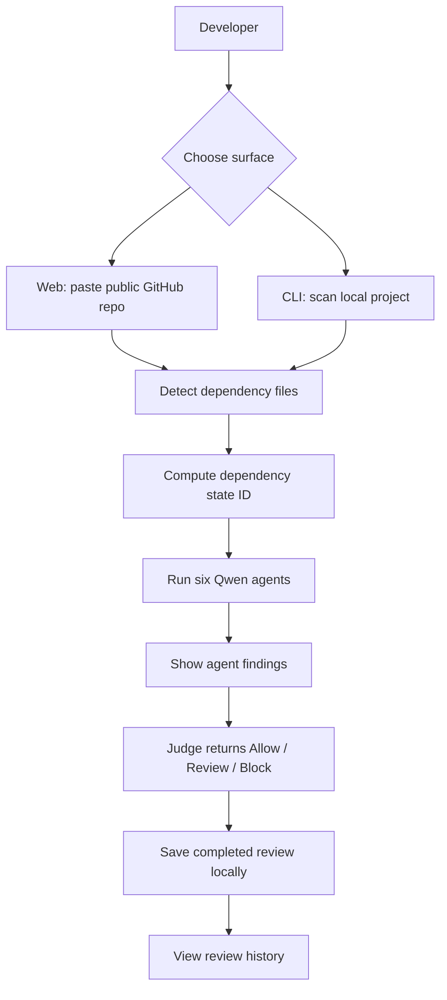

# Locksmith

Locksmith is a Qwen-powered dependency safety reviewer for developers and small teams. It puts a dependency state through six specialist agents before a package change is trusted.

> Locksmith puts dependency changes on trial before they enter your lockfile.

Primary hackathon track: **Track 3: Agent Society**

## Story Scenario

A small team is preparing a release. A dependency update lands right before merge, and nobody wants to approve a lockfile by gut feel. Locksmith lets the team paste a public GitHub repo or scan a local project, then asks six Qwen agents to inspect the dependency files, challenge weak evidence, and return an `Allow`, `Review`, or `Block` verdict.

## Problem Statement

Package managers make it easy to install code the team has not reviewed. A package update can add install scripts, transitive dependencies, source patterns, or behavior that is risky for one repo but harmless in another.

Most scanners answer, "Is this package suspicious?" Locksmith is aimed at the more useful team question:

> Is this exact dependency state safe for this repo, under this review policy, with the evidence we have?

## Solution

Locksmith retrieves dependency files, computes a stable dependency state ID, runs six role-specific Qwen agents, and saves completed reviews locally.

Implemented today:

- Public GitHub repo lookup and branch selection.
- Dependency file detection for `package.json`, `package-lock.json`, `pnpm-lock.yaml`, `yarn.lock`, `requirements.txt`, and `pyproject.toml`.
- Review jobs with live progress across six agents.
- Qwen-backed agent findings with structured verdicts, evidence, confidence, and final remediation.
- Local review history stored in `.locksmith/reviews.json`.
- Node CLI for scanning local dependency files.

## Product Concept

Locksmith is a Web2-first supply-chain review tool. It is not a wallet, token, staking, or on-chain audit product.

Core surfaces:

| Surface | Current state |
| --- | --- |
| Landing page | Explains the six-agent dependency review flow and links into scanning. |
| `/review` page | Imports a public GitHub repo, chooses a branch, starts a Qwen review, shows agent progress, and renders the final report. |
| `/history` page | Reads local saved reviews and shows prior findings. |
| CLI | `node bin/locksmith.mjs scan [project-directory]` reviews local dependency files with the same core engine. |

## User Flow



## System Architecture Flow

```mermaid
flowchart LR
  A[Browser UI] --> B[Next.js App Router]
  B --> C[/api/repo]
  B --> D[/api/review]
  B --> E[/api/review/:id]
  B --> F[/api/history]
  C --> G[GitHub REST API]
  D --> H[Review Job Store in memory]
  H --> I[Locksmith Core Engine]
  I --> J[Raw GitHub dependency files]
  I --> K[Qwen OpenAI-compatible API]
  I --> L[Dependency State Hash]
  H --> M[.locksmith/reviews.json]
  F --> M
  N[Node CLI] --> I
```

## Six-Agent Review Panel

| Agent | Implemented role |
| --- | --- |
| Baseline | Identifies package manager, direct dependencies, lockfile presence, and review scope. |
| Manifest | Reviews dependency file evidence such as scripts, versions, dependency counts, and visible metadata. |
| Static | Searches retrieved file text for risky patterns such as lifecycle scripts, `eval`, env access, file access, URLs, and shell execution. |
| Behavior | Infers install/runtime behavior from retrieved dependency files and labels it as inferred, not sandbox-observed. |
| Skeptic | Challenges unsupported claims and filters false positives before final judgment. |
| Judge | Resolves the prior findings into `Allow`, `Review`, or `Block` with the smallest remediation. |

## Tech Stack

| Layer | Technology |
| --- | --- |
| Frontend | Next.js 15, React 19, TypeScript, CSS |
| Backend | Next.js API routes on Node.js runtime |
| AI | Qwen through Alibaba Cloud Model Studio's OpenAI-compatible API |
| External data | GitHub REST API and raw GitHub file URLs |
| Storage | Local JSON file at `.locksmith/reviews.json` |
| CLI | Node.js executable script in `bin/locksmith.mjs` |

## Getting Started

Requirements:

- Node.js 20 or newer
- A Qwen API key from Alibaba Cloud Model Studio

```bash
npm install
cp .env.example .env.local
npm run dev
```

Open [http://localhost:3000](http://localhost:3000).

## Environment Variables

| Variable | Purpose |
| --- | --- |
| `QWEN_API_KEY` | Required. Alibaba Cloud Model Studio API key used for real agent analysis. |
| `QWEN_MODEL` | Required. Model name sent to the Qwen API. `.env.example` uses `qwen3.5-flash`. |
| `QWEN_BASE_URL` | Optional OpenAI-compatible endpoint. Defaults to `https://dashscope-intl.aliyuncs.com/compatible-mode/v1`. |

There is no mock mode in the current app. Reviews fail fast when `QWEN_API_KEY` or `QWEN_MODEL` is missing.

## Running Locally

Start the web app:

```bash
npm run dev
```

Build the app:

```bash
npm run build
```

Scan a local project with the CLI:

```bash
node bin/locksmith.mjs scan .
```

Inspect a public GitHub repo through the API:

```bash
curl -sS -X POST http://localhost:3000/api/repo \
  -H 'Content-Type: application/json' \
  -d '{"repo":"https://github.com/owner/repo"}'
```

Start a review:

```bash
curl -sS -X POST http://localhost:3000/api/review \
  -H 'Content-Type: application/json' \
  -d '{"repo":"https://github.com/owner/repo","branch":"main"}'
```

The review endpoint returns a `reviewId`. Poll `/api/review/{reviewId}` for progress and final results.

## Project Structure

```text
.
├── app/
│   ├── api/
│   │   ├── history/          # Reads local review history
│   │   ├── repo/             # Public GitHub repo inspection
│   │   └── review/           # Starts and polls review jobs
│   ├── components/           # Shared header and repo search form
│   ├── history/              # Saved review UI
│   ├── review/               # Live review UI and final report
│   └── page.tsx              # Landing page
├── bin/locksmith.mjs         # Local CLI scanner
├── lib/
│   ├── locksmith.ts          # Core review engine and Qwen agent prompts
│   ├── reviewHistory.ts      # Local JSON history
│   └── reviewJobs.ts         # In-memory async review jobs
├── SUBMISSION.md             # Hackathon submission requirements
└── README.md
```

## Demo / Screenshots

Demo assets are still needed.

Recommended demo flow:

1. Open the landing page.
2. Paste a public GitHub repository into `/review`.
3. Show dependency file detection and branch selection.
4. Start the Qwen review.
5. Show the six-agent progress timeline.
6. Show the final verdict, evidence, remediation, model, and dependency state ID.
7. Open `/history` to show the saved local review.
8. Run `node bin/locksmith.mjs scan .` to show the CLI using the same review engine.

## Current Limitations

- Review jobs are stored in memory, so polling fails after a server restart.
- Review history is local-only JSON, not a team backend.
- The app retrieves dependency manifests and lockfiles, not full package tarballs.
- Behavior analysis is inferred from retrieved files; there is no sandbox execution yet.
- There is no workspace approval layer, policy editor, repo trust file writer, or CI integration yet.
- There is no authentication, private GitHub import, or team account model.

## Roadmap

### Implemented MVP

- Next.js web app.
- Public GitHub repository inspection.
- Branch selection.
- Dependency file detection.
- Dependency state hashing.
- Six Qwen agent prompts and structured JSON findings.
- Live review job polling.
- Final verdict report.
- Local review history.
- Node CLI scan command.

### Needed for Hackathon Submission

From `SUBMISSION.md`, the following still needs to be completed before final judging:

| Requirement | Status |
| --- | --- |
| Public code repository URL | Needs final public repo link. |
| Open source license file visible at repo root | Not implemented. Add `LICENSE`. |
| Proof of Alibaba Cloud deployment | Not implemented. Need deployed backend and short proof recording. |
| Code file demonstrating Alibaba Cloud services/APIs | Partially implemented through Qwen API usage, but no deployment/service proof file yet. |
| Architecture diagram | Implemented in this README as Mermaid, but can be strengthened with deployment details after Alibaba Cloud hosting exists. |
| About 3-minute public demo video | Not implemented. |
| Text description of features/functionality | Implemented in this README. |
| Track identification | Implemented: Track 3 Agent Society. |
| Optional blog/social post | Not implemented. |

### After Submission

- Persist review jobs and history in a real backend database.
- Add workspace approvals and distinguish global analysis from team approval.
- Write `.locksmith/locksmith.json` trust pointers back to repos.
- Add package tarball/source inspection.
- Add controlled sandbox behavior checks.
- Add install wrappers such as `locksmith npm install`.
- Add CI/PR checks.
- Add private GitHub OAuth.

## Notes

- Public scans do not equal owner or team approval.
- Local history is useful for the demo, but it is not a team source of truth.
- The current app requires real Qwen credentials; it does not include deterministic mock findings.
